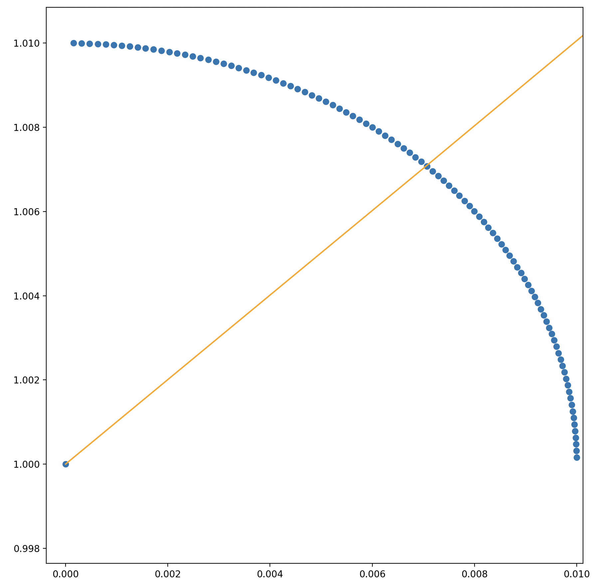

# eApprox
C program that approximates ex. It generates a text file containing the approximation and error values. A Python script then reads the data from the text file and graphs the results using Matplotlib. Here's what that looks like:

# Algorithm
This program relies on the principle that the function ex is a graph of its own slope. That is, the derivative of ex is also ex.

The program's functions are broken down below:

1. Start at point (0,1).
2. Generate evenly spaced points that fall along a quarter circle centered at (0,1) with some given radius.
3. Calculate the slope between each point that was generated and (0,1).
4. Select the point whose slope between itself and (0,1) is closest to its y value. Save this point.
5. Repeat the process around the new point. Now, slopes are calculated between points on the new quarter circle and the new point.

Here's what it looks like when points are generated around (0,1). The orange line connects (0,1) to the point that was selected.

And here's what the process looks like when it is repeated. The quarter circles don't look circular because the graph isn't a perfect square.

As an approximation for ex, this seems to work fairly well. However, experimenting with the program and evaluating its performance is left to the reader.
